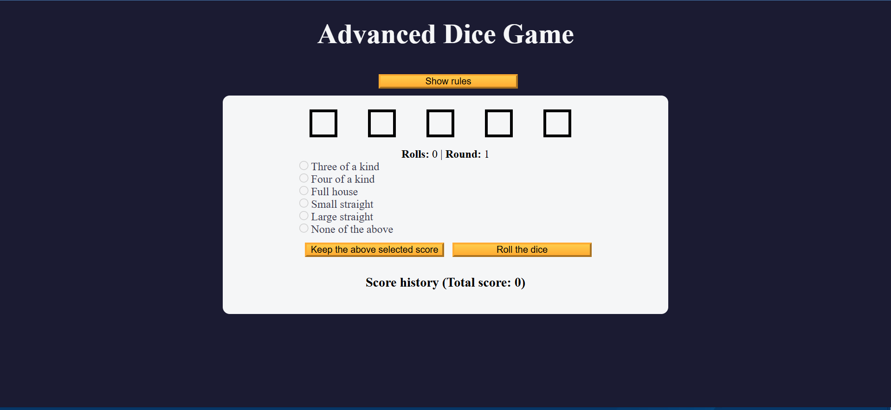

# Advanced Dice Game 🎲🎮

An enhanced version of the classic dice game, featuring multiple dice, game modes, and a fun, interactive interface!



<!-- 


 -->

---

## 🌟 Features

- Roll multiple dice and track the results.
- Customizable game settings.
- Play solo!
- Simple, intuitive UI.

---

## 📦 Installation

1. Clone this repository:
   ```bash
   git clone https://github.com/shiinedev/Advanced-Dice-Game.git
